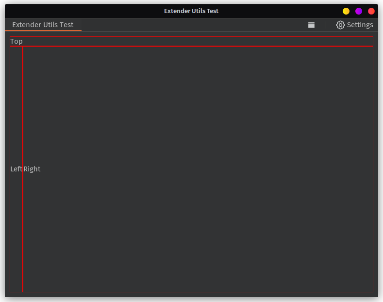
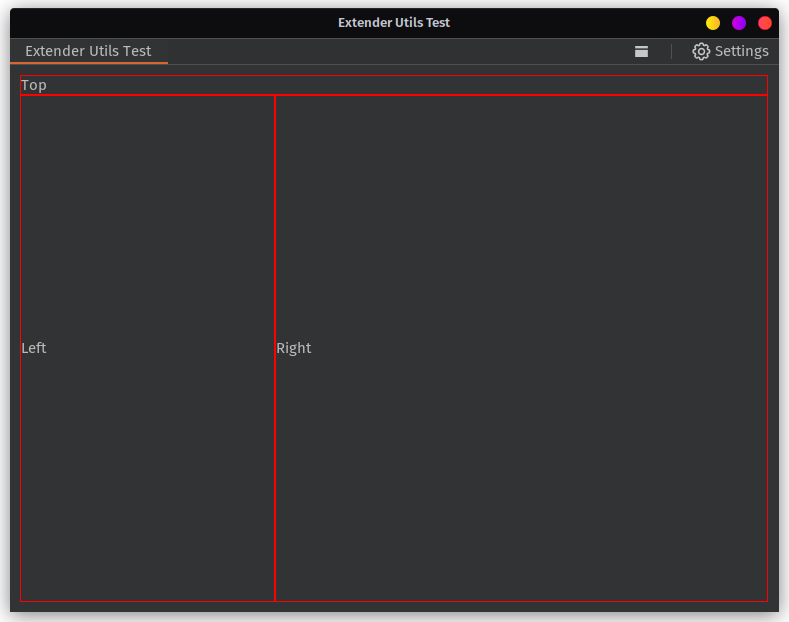
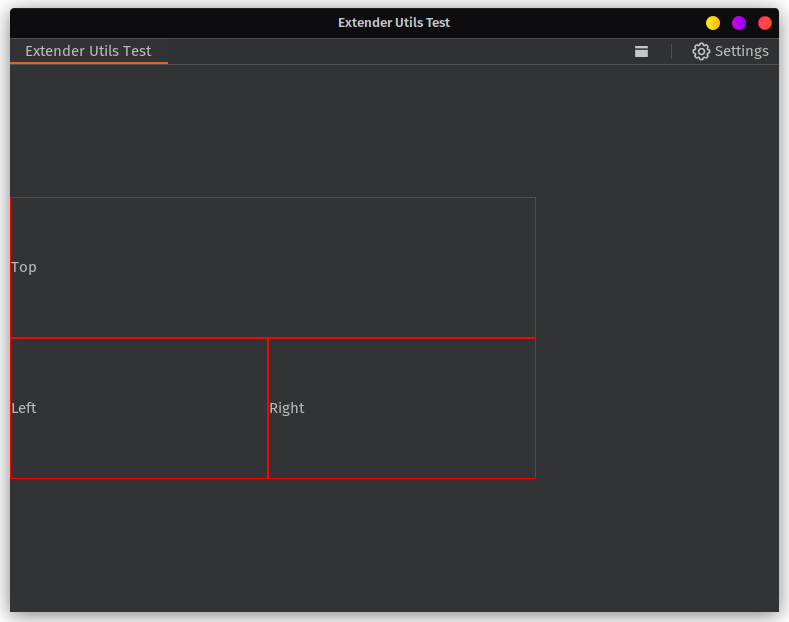
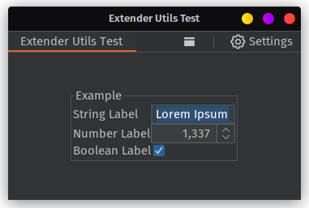
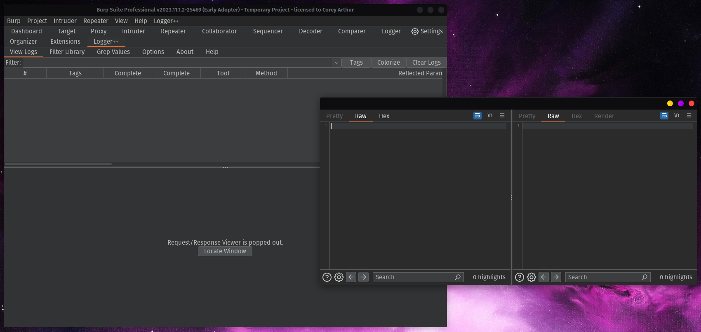

<h1 align="center">Burp Montoya Utilities</h1>
<h4 align="center">Preference and GUI Library for Burp Suite</h4>
<h4 align="center" markdown="1">by Corey Arthur  <a href="https://twitter.com/coreyd97/"></a></h4>
<p align="center">

  
  
  
  
</p>

---

This library aims to simplify the process of creating user interfaces for Burp Suite extensions and consists of two main parts, 
[Preference Management](#preferences) and [User Interface Generation](#user-interfaces).

# Installing
To use the library, simply add the following to your `build.gradle` file (Gradle) or `pom.xml` (Maven), where `[VERSION]` is a commit hash, version tag or `latest`.

### Gradle

```groovy
repositories {
    maven {
        url "https://jitpack.io"
    }
}

dependencies {
    implementation 'com.github.CoreyD97:Burp-Montoya-Utilities:[VERSION]'
}
```

### Maven

```xml
<repositories>
    <repository>
        <id>jitpack.io</id>
        <url>https://jitpack.io</url>
    </repository>
</repositories>

<dependency>
    <groupId>com.github.CoreyD97</groupId>
    <artifactId>Burp-Montoya-Utilities</artifactId>
    <version>[VERSION]</version>
</dependency>
```

# Preferences
This library can be used to define preferences to be used by your extension. The library will take care of handling
default values and serializing/deserializing the values for storing in Burp so that even complex objects can be stored.

The Montoya API has improved support for different data types, but this is still limited to more generic types provided 
by the API such as ByteArray, and HTTP requests and responses. If you want to store anything more complex, it needs to be
serialized and stored as a string in the Burp project.

## Registering Preferences
The recommended implementation is by creating a class that extends `PreferenceFactory`, but preferences can also be registered on the fly within the [`Preferences` object](#Preferences-Object). 
Both work the same way, but a `PreferenceFactory` can help structure the creation process.

### Preference Factory
A simple PreferenceFactory example is below.

```java
import com.coreyd97.BurpExtenderUtilities.Preferences.Visibility;

import java.beans.Visibility;

public class ExamplePreferenceFactory extends PreferenceFactory {
    public ExamplePreferenceFactory(MontoyaApi montoya) {
        //The only required parameter is the MontoyaApi.
        super(montoya);
        //If you want to log the library's operations, provide an ILogProvider implementation to the super call.
        //super(montoya, yourILogProvider);
    }

    @Override
    protected void createDefaults() {
        //Create any new objects that will be used as default values.
        //e.g. this.complexDefault = new ComplexObject();
    }

    @Override
    protected void registerTypeAdapters() {
        //Define any custom serializers that will be available to the GSON object.
        //e.g. this.gson.registerTypeAdapter(ComplexObject.class, new ComplexObjectAdapter());
        //See https://github.com/google/gson/blob/main/UserGuide.md#custom-serialization-and-deserialization
    }

    @Override
    protected void registerSettings() {
        //Register your preferences!
        prefs.register("Example", Boolean.class); //Preferences are global (all projects) by default.
        prefs.register("Another", String.class, Visibility.PROJECT); //But can be saved per-project if needed.
        prefs.register("WithADefault", Integer.class, 1337); //Default values can also be provided
        prefs.register("DefaultAndVisibility", String.class, "Hax", Visibility.VOLATILE); //Volatile preferences don't persist across reboots.
    }
}
```

Once your preference factory is setup, you can create and use the preference object like so:
```java
import com.coreyd97.BurpExtenderUtilities.Preferences;

public class MyExtension implements BurpExtension {
    @Override
    public void initialize(MontoyaApi montoya){
        Preferences prefs = new ExamplePreferenceFactory(montoya).buildPreferences();
        
        //Get Setting Value
        Integer example = prefs.getSetting("WithADefault");
        //Set Setting Value
        prefs.set("WithADefault", 999);
        
        //Checking Types
        prefs.getType("WithADefault"); //Integer.class
        
        //Reset to default
        prefs.reset("WithADefault"); //Resets to 1337.
        prefs.reset(Set.of("WithADefault", "Example")); //Reset multiple settings.
        prefs.resetAll(); //Reset all to defaults.
    }
}
```


# User Interfaces
The library also provides functions to simplify the process of creating user interfaces, and can automatically integrate
controls for your extension's preferences defined within the library.

## Generating Basic Panels
For complex user interfaces, GridBagLayout is usually the best LayoutManager. Though, manually defining the positions, 
cell widths and weights of each element can be frustrating. If you later add a new element, you often need to change each of the positions to accomodate the new item.

To make this easier, the `PanelBuilder` class can be used to build complex UIs in a more visual form.
The following code will create a panel with a panel at the top spanning the full width, while the lower section is split into two columns.

```java
JPanel top = new JPanel();
JPanel left = new JPanel();
JPanel right = new JPanel();

Component[][] layout = new Component[][]{
    new Component[]{top, top },
    new Component[]{left, right },
    new Component[]{left, right }
};

PanelBuilder pb = new PanelBuilder();
pb.setComponentGrid(layout);
JPanel userInterface = pb.build(); //Built panel containing the three inner panels.
```

### Defining Weights

Each element in the example above has a weight of 0 and so the elements will only take up the space required for their elements. Though, to control the scale we can provide weights for each element.

The below code will force the right panel to request 60% of the available horizontal (`x`) space, all available vertical (`y`) space. The left panel will just request as much vertical space as possible.
Though, since we haven't defined any weight for the left panel, it will only take up as much space is needed to fit its components.

<table>
<tr>
<td>

```java
PanelBuilder pb = new PanelBuilder()
.setComponentGrid(layout)
.setWeightX(right, 0.6)
.setWeightY(right, 1);
JPanel userInterface = pb.build();
```

</td>
<td width="50%">


</td>
</tr>
</table>

By adding some weights for the left panel, we can force the content to take a certain proportion of the available space. 
<table>
<tr>
<td>

```java
PanelBuilder pb = new PanelBuilder()
.setComponentGrid(layout)
.setWeightX(right, 0.6)
.setWeightX(left, 0.3)
.setWeightY(right, 1);
JPanel userInterface = pb.build(); 
```

</td>
<td width="50%">


</td>
</tr>
</table>

### Setting Weights Using a Grid

Alternatively, the library provides a way to set the weights in a grid format. 
The grid includes repeated values for each cell of a component. Only the first value for a component will be used, but it can be helpful to repeat the values to help visualize the end result.  

<table>
<tr>
<td>

```java
PanelBuilder pb = new PanelBuilder()
.setComponentGrid(layout)
.setGridWeightsX(new int[][]{
    new int[]{1, 1},
    new int[]{3, 6},
    new int[]{3, 6},
})
.setGridWeightsY(new int[][]{
    new int[]{0, 0},
    new int[]{1, 1},
    new int[]{1, 1},
})
JPanel userInterface = pb.build(); 
```

</td>
<td width="50%">


</td>
</tr>
</table>

### Alignment and Scale
The code below demonstrates how to scale and align panels using the panel builder.
Notes:
- If no weights are provided, all elements will only be large enough to fit their contents.
- If no scale is provided, the panel will fill the parent.

Available alignment options:

|  TOPLEFT   |   TOPMIDDLE  |   TOPRIGHT  |
|-----|-----|-----|
|  MIDDLELEFT  |  CENTER   |  MIDDLERIGHT  |
|  BOTTOMLEFT  |   BOTTOMMIDDLE  |   BOTTOMRIGHT |

<table>
<tr>
<td>

```java
PanelBuilder pb = new PanelBuilder()
    .setComponentGrid(new Component[][]{
        new Component[]{top, top },
        new Component[]{left, right },
        new Component[]{left, right }
    })
    .setGridWeightsX(new int[][]{
        new int[]{1, 1},
        new int[]{1, 1},
        new int[]{1, 1}
    })
    .setGridWeightsY(new int[][]{
        new int[]{1, 1},
        new int[]{1, 1},
        new int[]{1, 1}
    })
    .setScaleX(0.5)
    .setScaleY(0.5)
    .setAlignment(Alignment.MIDDLELEFT);
JPanel userInterface = pb.build();
```

</td>
<td width="50%">


</td>
</tr>
</table>


## Generating Preference Controls

After a preference has been registered, controls can easily be added to your User Interface using the library.
These controls will automatically populate with the preference's value at load, save the value when changed, 
and will update the component's value if the preference is changed from another source (via `setSetting()`).


### Component Groups
The most common way to generate preference components will be via a `ComponentGroup`. 
A Component Group is simply a single panel containing one or more settings, and can optionally have a label to organize its contents.

<table>
<td>

```java
import com.coreyd97.BurpExtenderUtilities.ComponentGroup.Orientation;
[...]
ComponentGroup example = new ComponentGroup(Orientation.VERTICAL, "Example");
example.addPreferenceComponent(preferences, "SomeString", "String Label");
example.addPreferenceComponent(preferences, "AnInteger", "Number Label");
example.addPreferenceComponent(preferences, "RandomBoolean", "Boolean Label");

PanelBuilder pb = new PanelBuilder()
    .setComponentGrid(new Component[][]{
        new Component[]{example}
    })
    .setScaleX(0.5)
    .setScaleY(0.5)
    .setAlignment(Alignment.CENTER);

JPanel userInterface = pb.build();
```
</td>
<td width="50%">


</td>
</table>

Preference types currently supported are:
- `String` (JTextField)
- `Number`,`Double`, `Float`, `Integer` (JSpinner)
- `Boolean` (JCheckbox)
- Any other type will default to JTextField.

### Adding Arbitrary Components to `ComponentGroup`
Component Groups are simply a wrapper around a panel. Therefore, other components can be added if desired. 
Calling `yourComponentGroup.add(someComponent)` will automatically add the component at the next location (depending on chosen orientation). 

If you wish to customize the GridBagConstraints for the new component, call `yourComponentGroup.generateNextConstraints(fill)` 
to get the base constraints for the next position, then use `yourComponentGroup.add(component, constraints)` to add. 
If this is not called, you will find that components are not arranged as expected.

### Manual Preference Controls

Each preference component can also be created manually via the static methods provided by the PanelBuilder class. These components will not automatically include a label for the component. 
- `PanelBuilder.createPreferenceTextField(preferences, settingName)`
- `PanelBuilder.createPreferenceSpinner(preferences, settingName)`
- `PanelBuilder.createPreferenceCheckBox(preferences, settingName)`


### Configuring Preference Controls
Some controls (e.g. numeric spinners) might need additional configuration such as upper and lower bounds. 
Therefore, `addPreferenceComponent` will also return the created component allowing its properties to be customized.

```java
JSpinner spinner = example.addPreferenceComponent(preferences, "AnInteger", "Number Label");
((SpinnerNumberModel) spinner.getModel()).setMinimum(1);
((SpinnerNumberModel) spinner.getModel()).setStepSize(1);
((SpinnerNumberModel) spinner.getModel()).setMaximum(25565);
```

# Utilities
This library also ships with a number of utility classes that proved helpful in building responsive extensions. These are listed below.

## Variable View Panel
A panel that can switch between horizontal, vertical or tabbed layout as required. 
The layout can also be loaded from a preference so that it is restored when the extension is loaded, and will automatically register the preference for you.

```java
JLabel leftPanel = new JLabel("Some Content");
JLabel rightPanel = new JLabel("Different Content");
VariableViewPanel variablePanel = new VariableViewPanel(preferences, "myVariablePanel", leftPanel, 
        "Left", rightPanel, "Right", VariableViewPanel.View.HORIZONTAL);

//Change to Vertical layout
variablePanel.setView(VariableViewPanel.View.VERTICAL);

//Change to Horizontal layout
variablePanel.setView(VariableViewPanel.View.HORIZONTAL);

//Change to Tabbed layout
variablePanel.setView(VariableViewPanel.View.TABS);
```

## Pop Out Panel
A simple panel wrapper that allows the component to be popped out into a separate frame. 
By default, the library will display a placeholder indicating that the component is popped out, but this can be disabled as shown below.

```java
JPanel contentPanel = new JPanel();
PopOutPanel popout = new PopOutPanel(montoya, contentPanel, "Example");
//To hide the placeholder, call the constructor with showPlaceholder = false
//PopOutPanel popout = new PopOutPanel(montoya, contentPanel, "Example", false);

popout.popOut(); //Pop Out
popout.popIn(); //Pop In
popout.toggle(); //Toggle State

//Simple menu item to pop your component in/out.
//Can be added to the element's context menu, or Burp's own JMenu.
JMenuItem menuItem = popout.getPopoutMenuItem(); 
```


